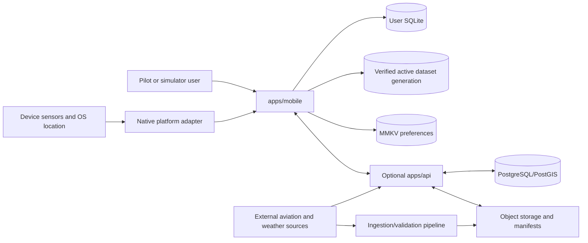
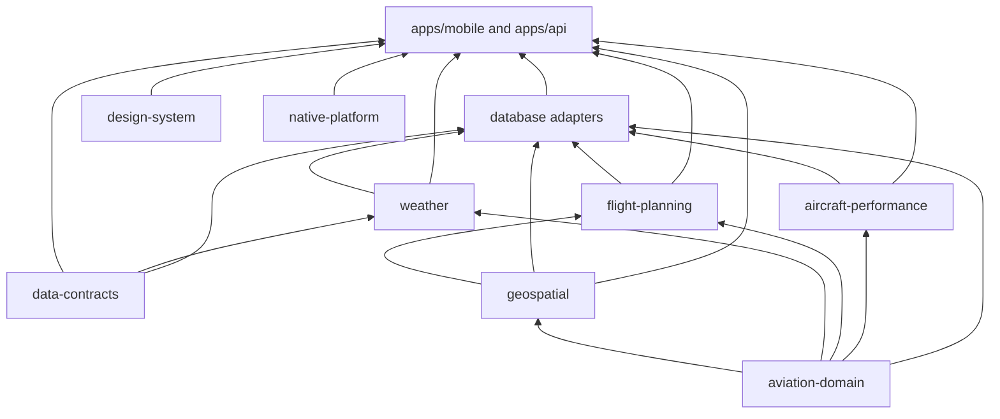

# Driftline system architecture

Status: proposed for Phase 0 integration
Scope: non-certified flight simulation, education, pre-flight planning, and
supplemental situational awareness

## Architectural intent

Driftline is an offline-first mobile system with an optional cloud service, not
a thin client. The installed and verified local dataset, local user database,
and device position source are sufficient for the core offline journeys. A
server may synchronize user-authored records and distribute manifests, but it
must never be required to open a saved flight, search downloaded airports, run
navigation calculations, or recover after process death.

The initial product is not an approved primary navigation instrument. The
architecture reduces misleading failure modes, but it does not confer aviation
approval, data licensing, or operational authorization.

## Context and trust boundaries

External data, device measurements, imported documents, and server responses
are untrusted inputs. Each crosses a Zod or native-to-TypeScript validation
adapter before becoming a domain object. Validation success does not imply
aeronautical correctness: provenance, effective time, expiry, jurisdiction,
confidence, verification state, and real/simulated/derived origin remain
attached to operationally relevant objects.

## Runtime components

### Mobile application

- Expo development builds on the React Native New Architecture; Expo Go is not
  a supported production-development environment because the map, MMKV, and
  local native modules require a custom native binary.
- Expo Router owns navigation and deep-link resolution, but route files contain
  composition and view code rather than calculations or persistence logic.
- MapLibre Native owns the basemap, camera, symbol placement, vector tile
  rendering, and camera-coupled route/airspace layers. Skia owns instruments,
  graphs, and bounded screen-space overlays. It does not duplicate the map
  renderer.
- A native platform adapter owns high-rate sensor collection, timestamping,
  permission/lifecycle changes, and any future sensor fusion. It emits bounded,
  typed snapshots and source-status events. Framework-independent TypeScript
  packages own deterministic route and navigation calculations.
- SQLite is authoritative for durable user records, the sync outbox, dataset
  registry, and normalized offline data. MMKV is limited to small, rebuildable
  preferences and launch hints. Zustand owns transient client state. TanStack
  Query owns remote request lifecycle and replaceable cached read models.

### Optional API

The API is a TypeScript service using Hono or Fastify, selected by a small
prototype before Phase 2. It validates shared wire contracts, stores account and
sync metadata in PostgreSQL/PostGIS, and issues short-lived object-storage
download URLs. Redis is not a baseline dependency; add it only for a measured
cross-instance coordination or caching requirement.

The API cannot silently rewrite a mobile navigation snapshot. Sync applies
versioned user-authored operations, reports conflicts explicitly, and treats
published aviation data as server-distributed immutable generations rather than
user-sync records.

### Data distribution

The build-side ingestion system is separate from the request API. It retains
source artefacts and licence metadata, validates and normalizes them, produces
deterministic regional packages, and publishes a signed manifest plus hashes.
Mobile downloads to a staging generation, verifies it, opens databases in
read-only mode for checks, then activates the generation with one local registry
transaction. The previous generation remains available for rollback.

## Package boundaries and dependency direction

The normative dependency rules are in
[`ADR-0001`](adr/0001-monorepo-and-package-boundaries.md). The intended graph is:

Arrows point from dependency to consumer. Domain and calculation packages do
not import React, React Native, Expo, Zustand, TanStack Query, SQLite, network
clients, or native platform code. `apps/*` are composition roots and may depend
on packages; packages never import an app. Cross-feature cycles are prohibited.

### Data categories

| Category | Example | Authority | Mutation policy |
|---|---|---|---|
| Source | downloaded FAA or other provider artefact | retained ingestion input | append-only, never used directly by UI |
| Normalized | airport, runway, airspace records | active dataset generation | immutable and versioned |
| Cached online | METAR/TAF response | local cache with explicit age | replaceable; never presented without source/retrieval time |
| User-created | route, aircraft, checklist state | user SQLite | transactional, revisioned, syncable |
| Derived | active leg, ETA, loading result | pure calculation from explicit snapshot | recompute; persist inputs and formula/version when auditing matters |
| Presentation | decluttered map feature, formatted unit | view-model adapter | transient; no domain authority |

## Critical flows

### Navigation update

1. Native code timestamps and qualifies location/sensor samples against a
   monotonic clock and emits a bounded snapshot.
2. The mobile adapter validates ranges and source/simulation identity.
3. A navigation session service combines the sample with an immutable route and
   active dataset snapshot, then calls pure geospatial/flight-planning functions.
4. Zustand publishes only the latest presentation snapshot; history is sampled
   to SQLite on a separately budgeted path if the user enabled recording.
5. MapLibre updates camera-coupled geometry and Skia updates instruments. If a
   source ages beyond its threshold, the computed state becomes stale or
   unavailable; last-known values are never relabelled as current.

### User edit and sync

1. Validate form input and convert display units to canonical domain units.
2. In one SQLite transaction, update the user record, increment its revision,
   and append an idempotent outbox operation.
3. Invalidate affected local read models and update the visible UI.
4. When connectivity and authentication are available, the sync worker sends
   ordered operations. Acknowledgements advance the outbox; conflicts become
   explicit records for deterministic policy or user resolution.

### Dataset activation

1. Check capacity for candidate plus active and rollback generations.
2. Resume download to a unique staging directory; verify manifest signature,
   file hashes, sizes, schema compatibility, licence metadata, and geographic
   coverage.
3. Run `PRAGMA quick_check` during download checkpoints and `integrity_check`
   before activation, plus application-level count/bounds/sentinel queries.
4. Commit the active generation ID in the control database. New repository
   leases use the candidate; existing reads drain against the old immutable
   generation.
5. Run post-activation smoke queries. On failure, transactionally restore the
   previous generation ID and quarantine the candidate.

## Performance budgets and measurement

Targets are budgets to instrument, not performance claims. Reference devices,
fixture sizes, build mode, thermal state, and sample count must be recorded with
every result.

| Path | Budget | Guardrail and evidence |
|---|---:|---|
| Warm map interaction | 60 fps target; p95 frame <= 16.7 ms, p99 <= 33.3 ms | release development build on a current baseline iPad; no per-frame React reconciliation |
| Cold launch to recoverable shell | <= 3.0 s p95 | no dataset migration/import on JS thread; shell may show explicit restoring state |
| Position-to-ownship presentation | <= 100 ms p95 after native receipt | coalesce samples; latest wins; preserve original sample time |
| Ordinary GA route recalculation (<= 100 legs) | <= 250 ms p95, <= 500 ms p99 | pure benchmark with fixed route/weather snapshot; move off JS thread if profiling breaches budget |
| Local airport search | <= 100 ms p95 for first 20 results | indexed/FTS query over defined full fixture; cancel superseded queries |
| Tap feedback | <= 100 ms; action response starts <= 250 ms | UI thread never waits for network or bulk SQLite work |
| JS long task during navigation | no task > 50 ms; <= 5 ms work per sensor tick p95 | profile with representative overlays and logging enabled |
| Dataset activation pause | <= 500 ms with no blank/unlabelled operational view | lease old generation until new handle is ready |
| Steady memory | establish per-device cap in Phase 1; no unbounded growth over 30 min | record native/JS/GPU high-water marks; cap visible tiles, features, and history |
| Battery | establish baseline in Phase 1; <= 10%/hour target for screen-on navigation on reference iPad | fixed brightness, GPS rate, radio state, map motion, and thermal protocol |

Bulk parsing, decompression, checksum work, database construction, and imports
must not run synchronously on the JavaScript or UI thread. Expo's module API
explicitly distinguishes synchronous functions that block JavaScript from
asynchronous functions dispatched away from it; native work must use bounded
async APIs and support cancellation.

## Failure recovery

| Failure | Required behavior | Recovery invariant |
|---|---|---|
| Process death | persist route/session intent and last acknowledged inputs transactionally; restore into a labelled paused/stale state | no automatic claim that navigation continued while dead |
| GPS/heading loss | age each source independently, stop derived updates that require it, display stale/unavailable plus accuracy | last value retains timestamp and source status |
| Partial/corrupt download | keep active generation untouched; resume verified chunks or discard staging | candidate cannot become active before full verification |
| Corrupt active dataset | stop affected queries, roll back to verified previous generation, quarantine/report | user database is never in the swapped generation |
| User DB migration failure | retain pre-migration backup, fail into read-only recovery/export mode | never reset user data silently |
| MMKV corruption | recreate defaults and reconstruct launch hints from SQLite | no route, outbox, dataset authority, or safety acknowledgement exists only in MMKV |
| Sync conflict | retain both server and local revisions and surface policy/result | sync never overwrites unacknowledged local intent invisibly |
| Weather/network failure | show cached observation with source and retrieval times plus computed age, or explicit unavailable | cache presence is not evidence of freshness |
| Native module crash/error | disable dependent capability and emit structured status | map/route data remains usable where independent |
| Disk pressure | pause before download/activation; preserve active and user data; offer region/cache deletion | never evict active operational data implicitly |

Recovery paths require deterministic fault-injection tests for kill points,
checksum failures, SQLite errors, clock changes, permission revocation, and
network transitions.

## Security and update boundary

- TLS protects transport; signed manifests plus file hashes establish artefact
  authenticity and integrity independently of transport.
- Secrets and refresh tokens use OS-protected credential storage, not SQLite,
  Zustand, TanStack cache, or MMKV. MMKV encryption alone is not the credential
  boundary.
- Dataset generation rollback protection is policy-driven: older generations
  may be activated only through a conspicuous recovery action, never because a
  replayed manifest has a valid signature.
- JavaScript/asset over-the-air updates must be runtime-version compatible and
  cannot change native contracts. Update rollout and rollback need the same
  safety evidence as store binaries.
- Location telemetry is opt-in, minimized, and separable from crash reporting.

## Realistic implementation sequence

1. **Freeze contracts and hazards:** accept ADRs; define typed units,
   provenance, source status, clocks, IDs, and error taxonomy. Resolve data
   licensing and platform support floors before selecting production datasets.
2. **Scaffold and enforce boundaries:** create pnpm workspace, strict shared
   TypeScript/ESLint config, dependency-cycle checks, package export maps, CI,
   Expo SDK development-build shell, and API placeholder without coupling core
   mobile startup to it.
3. **Prove highest-risk platform assumptions:** on physical iPad/iPhone and an
   Android reference device, spike MapLibre v11, offline style/tile loading,
   New Architecture, MMKV, expo-sqlite, background location, rotation/split
   view, and a minimal Expo native module. Record compatibility and frame data.
4. **Build pure core:** implement branded units, confidence/provenance,
   geodesic golden tests, route and active-leg state machine, simulator clock,
   and generic aircraft models with no React Native dependencies.
5. **Build local authority:** add user/control SQLite schemas, repositories,
   migrations, outbox, fixture aviation generation, indexed airport search, and
   corruption/process-death tests. Keep MMKV rebuildable.
6. **Deliver Phase 1 vertical slice:** map, simulator/real source distinction,
   airport search/detail, route editing/display, navigation dashboard subset,
   theme/accessibility, process recovery, and offline test on real devices.
7. **Prove update protocol before scale:** implement resumable regional package
   staging, validation, generation activation/rollback, storage-pressure UX,
   tiles/airspace/runways, and fault injection. Do not add cloud sync first.
8. **Add optional sync:** formalize operation IDs, revisions, conflicts,
   authentication, outbox replay, account deletion/export, and server audit.
9. **Add time-sensitive products:** weather adapters/cache/age policy and then
   wind-aware planning. Each source gets explicit validity and licence rules.
10. **Add performance and advanced awareness:** weight/balance, terrain,
    obstacles, and experimental synthetic vision only after sensor/data
    confidence degradation and benchmark gates exist.
11. **Harden:** multi-device E2E, offline soak, accessibility, privacy/security,
    independent QA and red-team gates, pilot usability plan, release runbook,
    and explicit remaining legal/licensing/approval dependencies.

## Open decisions and prototypes

- Minimum iOS/iPadOS and Android versions, based on device research and MapLibre
  v11 platform requirements.
- Production vector/raster tile format, packaging, and licence constraints.
- Whether Expo SQLite throughput is sufficient for full ingestion/activation;
  prototype before adding a purpose-built native data installer.
- Sensor fusion requirements and external Bluetooth GPS protocols. Do not build
  a fusion module before raw-source accuracy, background, and power tests.
- Sync conflict policies per entity. Routes, aircraft profiles, log entries, and
  checklist completion do not necessarily share one merge rule.
- Reference devices and dataset scale for enforceable memory and battery caps.

## Architecture decisions

- [`ADR-0001: pnpm monorepo and package boundaries`](adr/0001-monorepo-and-package-boundaries.md)
- [`ADR-0002: Expo New Architecture, MapLibre, and native boundary`](adr/0002-expo-new-architecture-map-and-native-boundary.md)
- [`ADR-0003: offline persistence and atomic dataset generations`](adr/0003-offline-persistence-and-atomic-data-generations.md)
- [`ADR-0004: state ownership and synchronization boundary`](adr/0004-state-and-sync-boundary.md)

## Primary references

- [Expo: React Native New Architecture](https://docs.expo.dev/guides/new-architecture/)
- [Expo: development builds](https://docs.expo.dev/develop/development-builds/introduction/)
- [Expo Modules API](https://docs.expo.dev/modules/module-api/)
- [Expo SQLite](https://docs.expo.dev/versions/latest/sdk/sqlite/)
- [MapLibre React Native: getting started and v11 requirements](https://maplibre.org/maplibre-react-native/docs/setup/getting-started/)
- [SQLite: atomic commit](https://www.sqlite.org/atomiccommit.html)
- [SQLite: write-ahead logging](https://www.sqlite.org/wal.html)
- [TanStack Query: React Native](https://tanstack.com/query/latest/docs/framework/react/react-native)
- [Zustand documentation](https://zustand.docs.pmnd.rs/)
