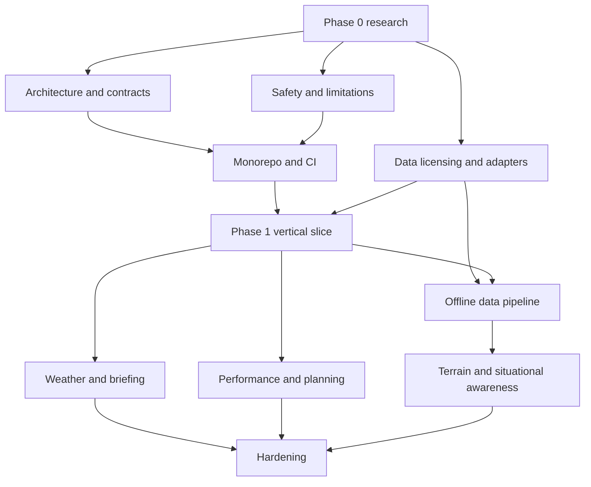

# Master execution plan

This plan is intentionally provisional until the Phase 0 specialist reviews are
integrated.

1. Establish research, safety, data-licensing, architecture, design, security,
   and test foundations.
2. Initialize the strict TypeScript/pnpm monorepo and automated quality gates.
3. Deliver a navigable offline-first vertical slice with explicit simulation and
   non-certified status.
4. Add versioned offline datasets, weather, planning, performance, terrain, and
   hardening in gated phases.
5. Require build, test, failure-mode, accessibility, performance, and safety
   evidence before closing any phase.

## Dependency graph

