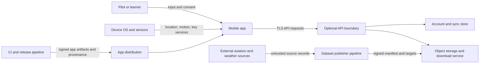

# Threat model

## Status and scope

This is the Phase 0 threat model for Driftline. It is a design constraint, not evidence that
controls are implemented. It covers the React Native mobile app, an optional TypeScript API,
local and downloaded data, build/update systems, and operator-facing support tools. It does not
claim certified avionics, regulatory approval, or protection on a fully compromised device.

The initial product supports simulation, education, pre-flight planning, and supplemental
non-certified situational awareness. A security failure can still become a safety hazard when it
produces convincing but incorrect navigation, weather, terrain, runway, or performance
information.

## Security objectives

1. **Truthful operational state:** forged, stale, corrupt, partial, or simulated data cannot
   appear current and verified.
2. **User control:** precise location, routes, aircraft profiles, documents, and account data
   are collected and shared only for an explicit purpose.
3. **Least privilege:** mobile permissions, tokens, API credentials, CI identities, and signing
   keys have the minimum scope and lifetime.
4. **Offline integrity:** downloaded datasets are authenticated before activation; failure
   preserves the last known-good version.
5. **Recoverability:** process death, interrupted updates, revocation, and deletion fail to a
   safe, explainable state.
6. **Traceability:** security-relevant releases and dataset activations can be tied to reviewed
   source, build provenance, manifest, and evidence.

## System and trust boundaries

Every arrow is a validation boundary. Native modules, deep links, imported routes/documents,
SQLite/MMKV state, network responses, sensor readings, clock values, and restored backups are
also untrusted inputs even when produced by a component we operate.

## Assets and sensitivity

| Asset                                            | Main harms if compromised                         | Required protection                                                                               |
| ------------------------------------------------ | ------------------------------------------------- | ------------------------------------------------------------------------------------------------- |
| Live and historical precise location             | stalking, profiling, physical safety              | local-first, explicit permission, minimised retention, no telemetry by default                    |
| Routes, favourites, aircraft and logbook data    | privacy loss, targeted fraud, unsafe plan changes | access control, integrity, export/deletion, encrypted transport and protected storage             |
| Auth refresh tokens and device keys              | account takeover and sync tampering               | OS secure storage, rotation, revocation, never logs/MMKV/SQLite                                   |
| Dataset signing roots and CI release credentials | fleet-wide malicious data/software                | offline/root separation, threshold or independently controlled approvals, short-lived CI identity |
| Dataset manifests and aviation records           | misleading navigation or planning                 | signature, checksum, version/expiry, schema and semantic validation, atomic activation            |
| Weather timestamps and source metadata           | stale weather represented as current              | authenticated source chain, monotonic age logic, explicit stale/unknown state                     |
| User-imported PDFs and route files               | parser exploit, active content, data leakage      | size/type limits, sandboxed parsing, no active content, local access controls                     |
| Telemetry and support bundles                    | latent location/token leakage                     | opt-in or strictly necessary collection, redaction, bounded retention, user preview               |

## Adversaries and conditions

- Remote unauthenticated attacker targeting public APIs or download endpoints.
- Authenticated user attempting cross-account access or resource enumeration.
- Malicious or compromised upstream dataset, CDN, dependency, CI action, or maintainer account.
- Network attacker able to delay, replay, truncate, or redirect traffic but not break correctly
  configured platform TLS.
- Malicious imported document, route, weather report, database, deep link, or backup.
- Opportunistic attacker with a lost unlocked device, device backup, or logs.
- Legitimate SDK or analytics vendor collecting more location/context than its stated purpose.
- Accidental operator error, clock rollback, timezone error, partial write, process death,
  sensor drift, or corrupted storage.

Out of scope as a guaranteed protection boundary: a rooted/jailbroken device with active
instrumentation, compromised OS, coercion of an authenticated user, and availability of upstream
GNSS or aviation authorities. These conditions must be detected or communicated where feasible,
not silently treated as safe.

## Threat register

Likelihood and impact are provisional until architecture and implementation exist. `Critical`
means capable of distributing dangerously convincing false operational data or broadly
compromising accounts.

| ID   | Threat and abuse case                                                                                             | Initial risk | Required preventive/detective control                                                                                                                                            | Verification                                                                   |
| ---- | ----------------------------------------------------------------------------------------------------------------- | -----------: | -------------------------------------------------------------------------------------------------------------------------------------------------------------------------------- | ------------------------------------------------------------------------------ |
| T-01 | Secret API or signing key embedded in JavaScript, native resources, Expo public environment, or OTA bundle        |     Critical | client contains only public identifiers; provider secrets and signing keys stay server/CI-side; automated secret and bundle scan                                                 | extract release bundles and strings; secret scanner with seeded canary         |
| T-02 | Refresh token copied from SQLite, MMKV, logs, crash report, or backup                                             |         High | store only in iOS Keychain/Android Keystore-backed storage; redact logs; exclude or invalidate restored credentials                                                              | device backup/restore and log inspection tests                                 |
| T-03 | Broken object-level authorization exposes another user's routes, documents, aircraft, or exports                  |         High | server derives subject from verified auth; opaque IDs; per-object authorization on every read/write/export/delete                                                                | negative API matrix across two accounts                                        |
| T-04 | Malformed or oversized API/import payload triggers crash, unsafe fallback, parser exploit, or resource exhaustion |         High | schema, length, range, content-type, and decompression limits at every boundary; fail closed without replacing valid state                                                       | fuzz/property corpus, zip-bomb and truncation fixtures                         |
| T-05 | Malicious, replayed, mixed-version, expired, or partially downloaded dataset activates                            |     Critical | trusted root, signed metadata, monotonically advancing versions, expiry, target length and SHA-256, consistent snapshot policy, schema/semantic checks, atomic swap and rollback | signature/rollback/freeze/mix-and-match/corruption fault injection             |
| T-06 | Compromised online signing key publishes false aviation data                                                      |     Critical | separated roles, threshold approvals for root/targets, offline root recovery, short-lived timestamp metadata, revocation drill, source reconciliation                            | tabletop key-compromise and recovery exercise                                  |
| T-07 | CDN or network returns valid old weather/dataset content                                                          |         High | TLS plus signed/versioned dataset metadata; source/retrieval/expiry visible; reject version rollback; weather cache policy never extends source validity                         | controlled replay and clock-change tests                                       |
| T-08 | Location is collected in background or sent to telemetry without clear user action                                |         High | foreground/When In Use default; separate contextual escalation; persistent indicator; no precise coordinates in analytics; privacy review of every SDK                           | permission and network-capture test on both platforms                          |
| T-09 | Simulator data contaminates real history or is displayed as live                                                  |         High | separate source identity/storage namespace; persistent simulation chrome; prohibit sync into operational history without explicit label                                          | process-death, export, and state-transition tests                              |
| T-10 | Sensor spoofing, stale fixes, or time rollback freezes a plausible own-ship state                                 |     Critical | age/accuracy/source tracked; monotonic elapsed time for freshness; degrade direction then remove live symbol; last-known marker labelled                                         | deterministic sensor traces, clock/timezone mutation, GPS outage tests         |
| T-11 | Local database corruption or interrupted migration silently changes route or units                                |         High | versioned migrations, integrity checks, immutable backup, transactional writes, typed units, quarantine and recovery UI                                                          | byte corruption, ENOSPC, kill-at-each-step fault tests                         |
| T-12 | Compromised package, install script, CI action, or build runner alters app                                        |     Critical | pnpm lockfile with frozen install; minimal scripts; pinned actions by immutable commit; least-privilege ephemeral CI; SBOM, provenance, artifact verification                    | clean rebuild, lock drift failure, attestation verification, dependency review |
| T-13 | Deep link or external URL causes unsafe navigation, account binding, or credential exfiltration                   |         High | allowlisted schemes/hosts, exact route schema, state/PKCE for auth, no credentials to dynamic origins                                                                            | hostile URL and redirect corpus                                                |
| T-14 | Imported PDF/SVG/HTML executes active content or accesses network                                                 |         High | allowlist formats; PDF rendered by maintained native sandbox; disallow HTML/SVG active preview; strip external actions where feasible                                            | malicious-file corpus and outbound-network observation                         |
| T-15 | Support bundle, screenshot, analytics, or crash report leaks location or token                                    |         High | field allowlist, coordinate reduction/removal, token scrubbing, user preview and consent, retention limit                                                                        | seeded-secret/coordinate exfiltration tests                                    |
| T-16 | User deletion removes cloud row but leaves objects, backups, derived indexes, or device copies indefinitely       |       Medium | deletion inventory and job, tombstone propagation, bounded backup expiry, status receipt, reinstall/other-device verification                                                    | deletion reconciliation across all stores                                      |
| T-17 | Certificate pinning blocks emergency endpoint/key rotation or creates unsafe offline assumptions                  |       Medium | default to platform trust and strong TLS; adopt pinning only after rotation/break-glass design and measured benefit; never bypass validation                                     | expired/intermediate/rotation/captive-portal tests if pinning adopted          |
| T-18 | Denial of service or rate abuse prevents sync/download and drains battery/storage                                 |       Medium | quotas, rate limits, resumable bounded downloads, storage budget, backoff and cancellation                                                                                       | throttled network, low disk, repeated request and thermal tests                |

## Cross-cutting control decisions

- React web controls such as CSP, DOM sinks, CSRF, SRI, and browser storage do not map directly
  to native React Native screens. Their underlying principles still apply: treat network/storage
  as untrusted, validate URLs, avoid dynamic code, minimise third-party code, and never put
  secrets in a client bundle.
- If Expo Router web or an administrative web app is later shipped, browser controls require a
  separate threat-model appendix and runtime header review.
- Certificate pinning is not a Phase 0 requirement. Platform trust stores, hostname validation,
  modern TLS, short-lived tokens, and signed datasets are the baseline. Pinning needs a
  documented threat it reduces, backup pins or an equivalent recovery path, telemetry that does
  not leak location, and a tested rotation plan before adoption.
- Safety-critical display correctness is jointly owned by Security, QA, and Red Team. Security
  sign-off cannot waive a failed navigation or stale-data gate.

## Open decisions before Phase 1 implementation

1. Account model, identity provider, token format/lifetime, and device-revocation semantics.
2. First production jurisdiction and dataset publisher/signing organisation.
3. Whether route/location history ever syncs by default; current assumption is no location
   history and user-initiated route sync only.
4. Selected document renderer and its native sandbox/update responsibility.
5. CI/release platform, app signing custody, and threshold approval mechanism.
6. Device/OS support matrix and minimum protected-storage capabilities.

## Primary references

- [Apple Keychain Services](https://developer.apple.com/documentation/security/keychain-services)
- [Android Keystore system](https://developer.android.com/privacy-and-security/keystore)
- [Apple: Requesting authorization to use location services](https://developer.apple.com/documentation/corelocation/requesting-authorization-to-use-location-services)
- [Android: Request location permissions](https://developer.android.com/develop/sensors-and-location/location/permissions)
- [The Update Framework specification](https://theupdateframework.github.io/specification/draft/)
- [NIST SP 800-218, Secure Software Development Framework 1.1](https://doi.org/10.6028/NIST.SP.800-218)
- [Expo environment variables](https://docs.expo.dev/guides/environment-variables/)
